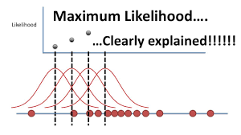

<style>
body {
  font-family: 'Segoe UI', sans-serif;
  background-color: #fdfdfd;
  color: #333333;
  line-height: 1.6;
  padding: 20px;
}

h1, h2, h3 {
  color: #1b4f72;
}

code {
  background-color: #f5f5f5;
  padding: 2px 4px;
  border-radius: 4px;
}

pre {
  background-color: #f8f9f9;
  padding: 10px;
  border-left: 4px solid #1b4f72;
  overflow-x: auto;
}

table {
  border-collapse: collapse;
  width: 100%;
}

th, td {
  border: 1px solid #dddddd;
  text-align: center;
  padding: 8px;
}

th {
  background-color: #e9f7ef;
}
</style>

> **Tujuan Utama dalam Statistika**  
> Dalam statistika, salah satu tujuan utama adalah untuk memahami karakteristik dari suatu populasi berdasarkan data sampel yang tersedia. Karena populasi seringkali sulit dijangkau sepenuhnya, maka diperlukan metode estimasi parameter dari data sampel.

## Pentingnya Estimasi Parameter

- Estimasi parameter penting untuk:
  - Pengambilan keputusan
  - Interpretasi hasil penelitian
- Kesalahan estimasi bisa berdampak besar pada kesimpulan.

## Maximum Likelihood Estimation (MLE)

> MLE adalah metode estimasi yang mencari parameter yang **memaksimalkan kemungkinan munculnya data** yang diamati.

- Berdasarkan pada **fungsi likelihood**
- Memungkinkan estimasi parameter **secara efisien**
- Umumnya digunakan dalam banyak distribusi: Poisson, Normal, Binomial, dsb.

📌 **Referensi tambahan:** [Penjelasan MLE berdasarkan Study.com](https://study.com/learn/lesson/mle-likelihood-statistics.html)

## Fungsi Likelihood dan Log-Likelihood

> Fungsi likelihood adalah fungsi dari parameter (bukan data) yang menunjukkan seberapa besar kemungkinan data diamati.

Secara matematis, misalkan $X = (x_1, x_2, ..., x_n)$ adalah sampel acak dari distribusi dengan parameter $\theta$:

$$
L(\theta) = \prod_{i=1}^n f(x_i|\theta)
$$

Karena bentuknya perkalian, digunakan log-likelihood:

$$
\ell(\theta) = \log L(\theta) = \sum_{i=1}^n \log f(x_i|\theta)
$$

---

## Contoh : Estimasi MLE pada Distribusi Poisson

```{r poisson-mle-estimation, eval=TRUE, echo=TRUE, warning=FALSE, cache=FALSE}
# Fungsi log-likelihood sebagai fungsi dari lambda dan data
poissonLogLik = function(lambda, data){
  n = length(data)
  logLik = (sum(data)*log(lambda) - n*lambda)
  return(-logLik)
}

# Fungsi untuk menjalankan simulasi dan menghitung MLE
mle.pois = function(n, lambda=0){
  set.seed(100)
  x = rpois(n, lambda)
  mle = optim(par=1, fn=poissonLogLik, data = x)
  lambda.hat = mle$par
  bias = lambda.hat - lambda
  cbind(n = n, lambda.hat = lambda.hat, bias = bias)
}

# Menjalankan simulasi dengan berbagai ukuran sampel
n = c(10, 100, 1000, 10000)
result = do.call(rbind, lapply(n, FUN = mle.pois, lambda = 2))
knitr::kable(result, caption = "Hasil Estimasi MLE untuk Distribusi Poisson")

# Visualisasi data acak dari distribusi Poisson dan nilai estimasi lambda
set.seed(100)
x = rpois(n = 1000, lambda = 2)
hist(x, breaks = 20, main = "Histogram Sampel Poisson", xlab = "Nilai", col = "pink", border = "white")
abline(v = mean(x), col = "#006400", lwd = 3)
legend("topright", legend = paste("Mean ≈", round(mean(x), 2)), col = "#006400", lwd = 3)
```

### 🎥 Video Penjelasan Tambahan

Untuk pemahaman lebih lanjut mengenai konsep **Maximum Likelihood Estimation (MLE)**, berikut adalah video penjelasan yang mudah dipahami:

[{width=60%}](https://youtu.be/XepXtl9YKwc)

> 📌 *Sumber: YouTube – StatQuest with Josh Starmer*

---

## 📚 Daftar Pustaka

1. Study.com. (2023). *Statistical Estimation: Explanation & Overview*. Diakses dari: [https://study.com/academy/lesson/statistical-estimation-explanation-overview.html](https://study.com/academy/lesson/statistical-estimation-explanation-overview.html)

2. Study.com. (2023). *Maximum Likelihood Method | MLE Overview & Examples*. Diakses dari: [https://study.com/learn/lesson/mle-likelihood-statistics.html](https://study.com/learn/lesson/mle-likelihood-statistics.html)

3. YouTube – StatQuest with Josh Starmer. (2017). *Maximum Likelihood, clearly explained!!!* Diakses dari: [https://youtu.be/XepXtl9YKwc](https://youtu.be/XepXtl9YKwc)
